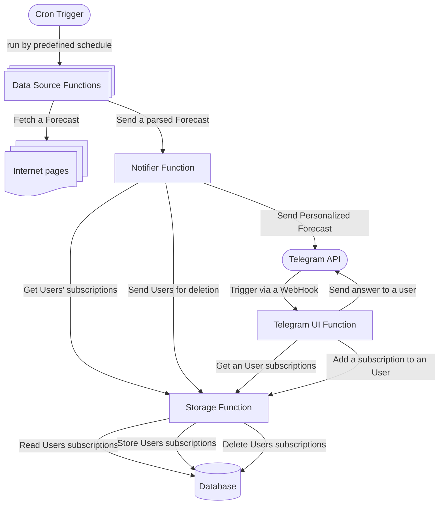

# Shipping Forecast Bot

## Description
The main idea of this project is to create a bot that tweets the shipping forecast every day at predefine 
scheduled time periods. The shipping forecast is weather reports and forecasts for the seas around 
the coasts. The forecast is produced by the National Met Offices.

## Technologies
- language: 
- libraries:
- database:
- testing:
- infrastructure:
- CI/CD:
- monitoring:
- logging:

## Architecture

The project is mostly stateless and consists of the following components:
- **TelegramUI Component**: A function that receives Telegram Webhook updates, interacts with users providing them a way to subscribe onto different forecast areas and sends the result to the **storage** function.
- **Source Components**: A set of independent stateless functions that are started by cron, fetch, and parse the shipping forecast data from different data sources. After that a function triggers the **notifier** function and pass the forecast to it.
- **Notifier Component**: A stateless function that receives the forecast data from *Sources* and the users' subscriptions to dispatch forecasts using the Telegram REST API. It also tracks users that had blocked the bot and sends their ids to **storage** to delete from the database.
- **Storage Component**: A function that stores the users' subscriptions and the forecast data. It also deletes users that had blocked the bot.

A [Mermaid](https://www.mermaidchart.com/play) flowchart diagram:

### Data Sources
Supported data sources:

| Provider                   | Type    | Area                 | Link                                                                                               |
|----------------------------|---------|----------------------|----------------------------------------------------------------------------------------------------|
| The Deutscher Wetterdienst | Marine  | North and Baltic Sea | [dwd.de](https://www.dwd.de/EN/ourservices/seewetternordostseeen/seewetternordostsee.html)         |
| The Deutscher Wetterdienst | Coastal | North and Baltic Sea | [dwd.de](https://www.dwd.de/EN/ourservices/kuestenseewetterberichten/kuestenseewetterbericht.html) |

## How to run the project

## How to run the tests

## How to deploy the project

## How to monitor the project

## How to log the project

## How to contribute to the project

