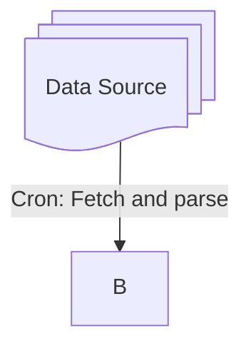

# Shipping Forecast Bot

## Description
The main idea of this project is to create a bot that tweets the shipping forecast every day at predefine 
scheduled time periods. The shipping forecast is weather reports and forecasts for the seas around 
the coasts. The forecast is produced by the National Met Offices.

## Technologies
- language: 
- libraries:
- database:
- testing:
- infrastructure:
- CI/CD:
- monitoring:
- logging:

## Architecture

### Data
Supported data sources:

| Provider                   | Type    | Area                 | Link                                                                                               |
|----------------------------|---------|----------------------|----------------------------------------------------------------------------------------------------|
| The Deutscher Wetterdienst | Marine  | North and Baltic Sea | [dwd.de](https://www.dwd.de/EN/ourservices/seewetternordostseeen/seewetternordostsee.html)         |
| The Deutscher Wetterdienst | Coastal | North and Baltic Sea | [dwd.de](https://www.dwd.de/EN/ourservices/kuestenseewetterberichten/kuestenseewetterbericht.html) |

### Data Flow
 A [Mermaid](https://www.mermaidchart.com/play) flowchart diagram:

## How to run the project

## How to run the tests

## How to deploy the project

## How to monitor the project

## How to log the project

## How to contribute to the project

